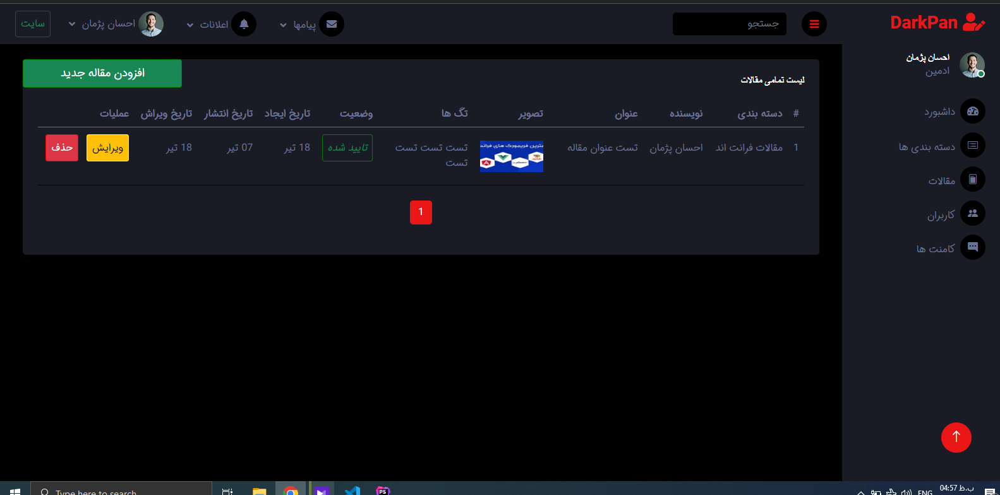

  
  <h3 align="center">weblog_cms Project</h3>
  <h5 align="center">version 1.0.0-beta (jul 9 2023)</h5>
  

    Weblog CMS Project
     
    |
    <a href="https://github.com/EhsanPazhman/weblog_cms/issues">Report Bug</a>
    |
     <a href="https://github.com/EhsanPazhman/weblog_cms/issues">Request Feature</a>
  

## Table of Contents
- [Table of Contents](#table-of-contents)
- [About weblog_cms Project](#about-weblog_cms-project)
- [Built with](#built-with)
- [Setup training](#setup-training)
- [Features](#features)
- [Features in future updates](#features-in-future-updates)
- [Screenshot](#screenshot)
- [Important things](#important-things)
- [Bugs in the project](#bugs-in-the-project)
- [Contact with me](#contact-with-me)
- [License](#license)

## About weblog_cms Project
This project is licensed under the terms of the MIT license and developed by Ehsan Pazhman.
This project in beta version and has also been developed procedurally.
This project has been developed in Persian language and 
 give feedback or request features that you would like to be added to the project.
be successful and victorious.

## Built with
- PHP 8
- HTML 5
- CSS 3
- Bootstrap 4 & 5 
- MariaDB 10.4.17 (You can use MySQL and...)
- DB-Connection (PDO)

## Setup training
 1. Create a database of your choice and import the tables from the blog.sql file at the root of the project.
 2. Enter the bootstrap folder and set your database information in the config.php file.
 3. Enter the bootstrap folder and set your information in the constants.php file.

## Features
- Register and login users
- Password repeat
- Checking the uniqueness of the user`s email
- BCRYPT method to store user password
- User logout
- Count the number of authors
- Count the number of users
- Count the number of posts
- Counting the number of views a post
- Counting the number of comments on a post
- Limit display post text
- Search for posts
- Prevent sql injection
- Utf8mb4 character
- Admin panel for management
- Manage posts > delete , add , edit , publish
- Manage categories > delete , add , edit 
- Manage comments > delete , add , edit , status 
- Manage users > delete , changeRole
- Pagination for categories
- Pagination for comments
- Pagination for users
- Pagination for comments
- Pagination for posts
- Persian language
- High speed

## Features in future updates
- Improved UI
- Responsiveness of the whole project
- Reset Password
- Remember me
- Login using social networks
- Filter categories and posts
- English language (in the stable version)
- and more...

## Screenshot

## Important things
 1. This app can be used on mobiles and tablets but has not yet been optimized for these devices.
 2. Your pull requests are all reviewed and accepted if possible.

## Bugs in the project
My good friend, if you find a bug in the project, you can let me and other friends know via GitHub. [https://github.com/EhsanPazhman/weblog_cms/issues](https://github.com/EhsanPazhman/weblog_cms/issues)

## Contact with me
 - By Email [ehsanpazhman@gmail.com](mailto:ehsanPazhman@gmail.com)

## License

This project is licensed under the terms of the MIT license. © [Ehsan Pazhman](https://github.com/EhsanPazhman/weblog_cms)